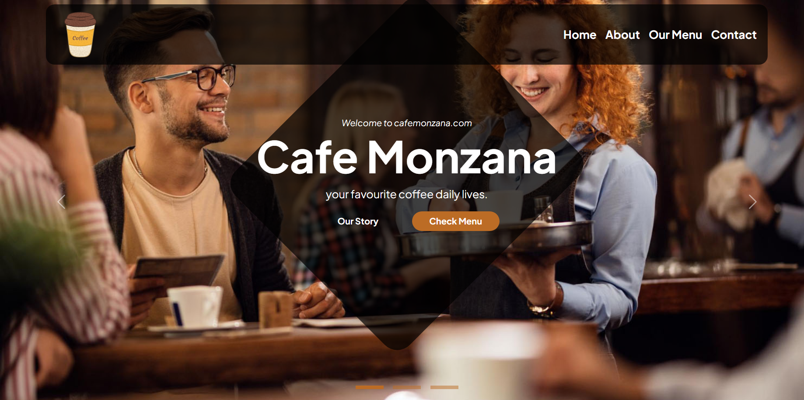

# Cafe Montana Website

This is a website for Cafe Montana, built using HTML, CSS, and Bootstrap 5. It features a responsive design, a carousel slider, menu sections, team member profiles, and a contact form with a Google Maps integration.


## Features

- **Responsive Design:** The website is designed to work seamlessly on various screen sizes, thanks to Bootstrap 5.
- **Carousel Slider:** A dynamic image carousel on the homepage to showcase cafe highlights.
- **Navigation Bar:** A responsive navigation bar with links to different sections of the website.
- **About Us Section:** Information about Cafe Montana, its history, and its values.
- **Meet People Section:** Profiles of the cafe's team members with social media links.
- **Our Menu Section:** A tabbed menu section showcasing coffee, food, and dessert options with image lightboxes.
- **Contact Section:** A contact form and a Google Maps integration to help users find the cafe.
- **Footer:** Contact information, opening hours, and social media links.
- **Image Lightbox:** fslightbox.js is used for image lightbox functionality in the menu section.
- **Bootstrap Icons:** Used for icons throughout the website.

## Technologies Used

- **HTML5:** For the structure of the website.
- **CSS3:** For styling the website.
- **Bootstrap 5:** For responsive design and UI components.
- **JavaScript:** For Bootstrap components and custom functionality.
- **fslightbox.js:** For image lightbox functionality.
- **Google Maps:** For the embedded map in the contact section.

## Getting Started

To run this project locally, follow these steps:

1.  **Clone the repository:**

    ```bash
    git clone [repository URL]
    ```

2.  **Navigate to the project directory:**

    ```bash
    cd [project directory]
    ```

3.  **Open `index.html` in your web browser.**

## File Structure
cafe-montana/
├── index.html
├── css/
│   └── style.css
├── img/
│   ├── about.jpg
│   ├── slider1.jpg
│   ├── slider2.jpg
│   ├── slider3.jpg
│   ├── menu/
│   │   ├── coffee/
│   │   ├── food/
│   │   └── dessert/
│   └── team/
│       ├── our-team-1.jpg
│       ├── our-team-2.jpg
│       ├── our-team-3.jpg
│       ├── our-team-4.jpg
│       ├── our-team-5.jpg
│       └── our-team-6.jpg
├── README.md
└── lib/
    └── fslightbox.js

## Usage

-   **Navigation:** Use the navigation bar to move between different sections of the website.
-   **Carousel:** The carousel on the homepage automatically slides through images. You can also use the navigation arrows or indicators to manually navigate.
-   **Menu:** Click on the tabs in the menu section to switch between coffee, food, and dessert options. Click on the images to view them in a lightbox.
-   **Contact:** Fill out the contact form to send a message. Use the embedded Google Map to find the cafe's location.
-   **Team:** click on the social media icons to view the team members social media pages.

## Contributing

Contributions are welcome! If you have any suggestions or find any issues, please feel free to submit a pull request or open an issue.

1.  Fork the repository.
2.  Create a new branch for your feature or bug fix.
3.  Commit your changes.
4.  Push your changes to your fork.
5.  Submit a pull request.

## License

This project is licensed under the [MIT License](LICENSE).